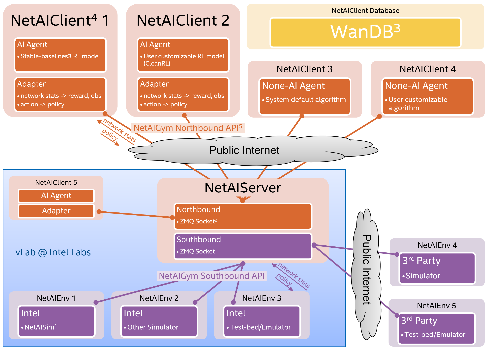
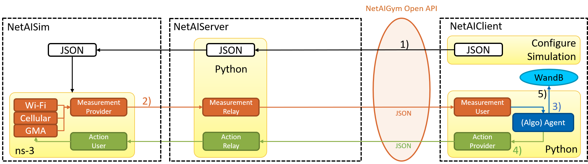

# Quick Start

## Get Access to NetworkGym Testbed via vLab


We have hosted NetworkGym Env (Server and Simulator) on [vLab](https://registration.intel-research.net/) machines to collaborate with MLWiNS/RINGs universities.
By utilizing the [NetworkGym Open API](https://github.com/IntelLabs/gma/blob/master/network_gym_client/northbound_interface.py), a [NetworkGymClient](https://github.com/pinyaras/GMAClient) can establish a connection with the NetworkGym Environment through either the public internet or Intel's internal network.
If you have any issue getting access to vLab, please reach out to us at [netaigym@gmail.com](mailto:netaigym@gmail.com).

Next, we plan to launch NetworkGym Sim-aaS via **Intel DevCloud** and make it available for all Intel developers. 
In the meantime, we are collaborating with the research community to enhance NetworkGymSim with new use-cases & capabilities, e.g., 5G/O-RAN, distributed computing, RAN energy saving, predictive QoS, etc. 

## Launch Your First Network AI Simulation


After acquiring early access to NetworkGym, you can proceed to download the client software, [NetworkGymClient](https://github.com/pinyaras/GMAClient), in order to initiate your initial simulation.
For additional information regarding the client software, please refer to the [NetworkGymClient](https://github.com/pinyaras/GMAClient) Github Repository.

```{admonition} ▶️ Upon starting the NetworkGymClient, the following series of steps occur:
1. The NetworkGymClient initiates by sending a JSON configure file to the Server, triggering the launch of an ns-3 simulation.
```

```{admonition} 🔁 During the simulation, the process repeats as follows:
2. Simualtor collects measurement metrics and transmits them to the Server.
    - The Server forwards the measurements to the NetworkGymClient using the NetworkGym Open API.
3. An Algorithm Agent, which could be either AI or non-AI, computes an action based on the received measurements and stores relevant data in WandB.
4. The NetworkGymClient transmits the computed action to the Simulator through the NetworkGym Open API, enabling the simulation to continue with the new action.
```

```{admonition} ⏹️ When the NetAIClient or the simulation concludes:
5. The data stored in Wandb can be conveniently visualized on the Wandb website.
```
