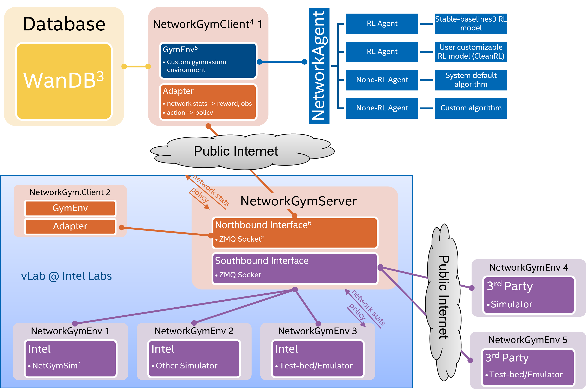

# Quickstart

## Get Access to NetworkGym Testbed via vLab


We have hosted NetworkGymServer and NetworkGymEnv on [vLab](https://registration.intel-research.net/) machines to collaborate with MLWiNS/RINGs universities.
By utilizing the [NetworkGym Northbound Interface](https://github.com/IntelLabs/gma/blob/master/network_gym_client/northbound_interface.py), a [NetworkGymClient](https://github.com/pinyaras/GMAClient) can establish a connection with the NetworkGym Environment through either the public internet or Intel's internal network.
If you have any issue getting access to vLab, please reach out to us at [netaigym@gmail.com](mailto:netaigym@gmail.com).

Next, we plan to launch NetworkGym Sim-aaS via **Intel DevCloud** and make it available for all Intel developers. 
In the meantime, we are collaborating with the research community to enhance NetworkGymSim with new use-cases & capabilities, e.g., 5G/O-RAN, distributed computing, RAN energy saving, predictive QoS, etc. 

## Basic Usage


After acquiring early access to NetworkGym, you can proceed to download the client software, [NetworkGymClient](https://github.com/pinyaras/GMAClient), in order to initiate your simulation.

```{admonition} ▶️ Upon starting the NetworkGymClient, the following series of steps occur:
1. The NetworkGymClient initiates by sending a JSON configure file to the Server, triggering the launch of an ns-3 simulation.
```

```{admonition} 🔁 During the simulation, the process repeats as follows:
2. Simualtor collects measurement metrics and transmits them to the Server.
    - The Server forwards the measurements to the NetworkGymClient using the NetworkGym Open API.
3. An Algorithm Agent, which could be either AI or non-AI, computes an action based on the received measurements and stores relevant data in WandB.
4. The NetworkGymClient transmits the computed action to the Simulator through the NetworkGym Open API, enabling the simulation to continue with the new action.
```

```{admonition} ⏹️ When the NetworkGym or the simulation concludes:
5. The data stored in Wandb can be conveniently visualized on the Wandb website.
```
In the following, we will provide some basic python code to interfact with NetworkGym environements.

### Initializing Environments

Initializing environments is very easy in NetworkGym and can be done via the ``network_gym_client`` package:

```python
from network_gym_client import Env as NetworkGymEnv
# make a network env using pass client id and configure file arguements.
env = NetworkGymEnv(client_id, config_json) 
```

This will return an ``Env`` for users to interact with.

### Interacting with the Environment

The classic "agent-environment loop" is implemented using the following code

```python
from network_gym_client import load_config_file
from network_gym_client import Env as NetworkGymEnv

client_id = 0
env_name = "nqos_split"
config_json = load_config_file(env_name)

# Create a network env using pass client id and configure file arguements.
env = NetworkGymEnv(client_id, config_json) 

num_steps = 1000
obs, info = env.reset()

for step in range(num_steps):

    action = env.action_space.sample()  # agent policy that uses the observation and info
    obs, reward, terminated, truncated, info = env.step(action)

    # If the epsiode is up (environment still running), then start another one
    if truncated:
        obs, info = env.reset()

    # If the environment is end, exit
    if terminated:
        break
```

### Explaining the code

First, the configuration file is loaded using the `load_config_file` function by providing the selected environement name. Second, an environment is created using `NetworkGymEnv` class with an additional keywords `client_id` and `config_json`. A `client_id` is associated to a dedicated environment worker until the environment session end. A client may use different `client_id` to launche parallel environments. After initializing the environment, we ``reset`` the environment to get the first observation of the environment.

Next, the agent performs an action in the environment, `step`. As a result, the agent receives a new observation from the updated environment along with a reward for taking the action. One such action-observation exchange is referred to as a *timestep*.

In NetworkGym, an environment includes multiple episodes. The terminal state for a episode and environment is signaled using the trucated and terminated signal returned by `step`. For example, after a fixed number of timesteps, an episode is ended by issueing a truncated signal. And after multiple episodes, the environment terminates with a terminated signal. If ``truncated`` is `true` then ``reset`` should be called next to restart the episode. If the `termianted` is `true` then the client needs to restart the environement.

An example is provided in the following.
```{mermaid}
sequenceDiagram

    agent->>+env: Environment Start (episodes=3)
    env-->>agent: Episode End (Truncation=True, Termination=False)
    env-->>agent: Episode End (Truncation=True, Termination=False)
    env-->>-agent: Episode and Environment End (Truncation=True, Termination=True)

    agent->>+env: Environment Start (episodes=1)
    env-->>-agent: Episode and Environment End (Truncation=True, Termination=True)

```


### Action and observation spaces

Every environment specifies the format of valid actions and observations with the ``env.action_space`` and ``env.observation_space`` attributes. This is helpful for both knowing the expected input and output of the environment as all valid actions and observation should be contained with the respective space.

In the example, we sampled random actions via ``env.action_space.sample()`` instead of using an agent policy, mapping observations to actions which users will want to make. For NetworkGYm, some of the environments also have system default algorithms, which can be enabled by sending "empty" action to the environment. e.g.,
```python
    #no action from the rl agent -> the environment will use system default policy
    action = np.array([])
    obs, reward, terminated, truncated, info = env.step(action)
```

Every environment should have the attributes ``action_space`` and ``observation_space``, both of which should be instances of classes that inherit from ``Space``. Gymnasium has support for a majority of possible spaces users might need:

- ``Box``: describes an n-dimensional continuous space. It's a bounded space where we can define the upper and lower
  limits which describe the valid values our observations can take.
- ``Discrete``: describes a discrete space where {0, 1, ..., n-1} are the possible values our observation or action can take.
  Values can be shifted to {a, a+1, ..., a+n-1} using an optional argument.
- ``Dict``: represents a dictionary of simple spaces.
- ``Tuple``: represents a tuple of simple spaces.
- ``MultiBinary``: creates an n-shape binary space. Argument n can be a number or a list of numbers.
- ``MultiDiscrete``: consists of a series of ``Discrete`` action spaces with a different number of actions in each element.


### Modifying the environment

Our NetworkGym also supports the [Wrappers](https://gymnasium.farama.org/content/basic_usage/#modifying-the-environment) provided by the Gymnasium. Some exmaples:
- `TimeLimit`: Issue a truncated signal if a maximum number of timesteps has been exceeded (or the base environment has issued a truncated signal).
- `ClipAction`: Clip the action such that it lies in the action space (of type `Box`).
- `RescaleAction`: Rescale actions to lie in a specified interval
- `TimeAwareObservation`: Add information about the index of timestep to observation. In some cases helpful to ensure that transitions are Markov.
- `FlattenObservation`: Observation wrapper that flattens the observation.
- `NormalizeObservation`: This wrapper will normalize observations s.t. each coordinate is centered with unit variance.

```python
env = NetworkGymEnv(args.client_id, config_json)
normal_obs_env = NormalizeObservation(env)
```
