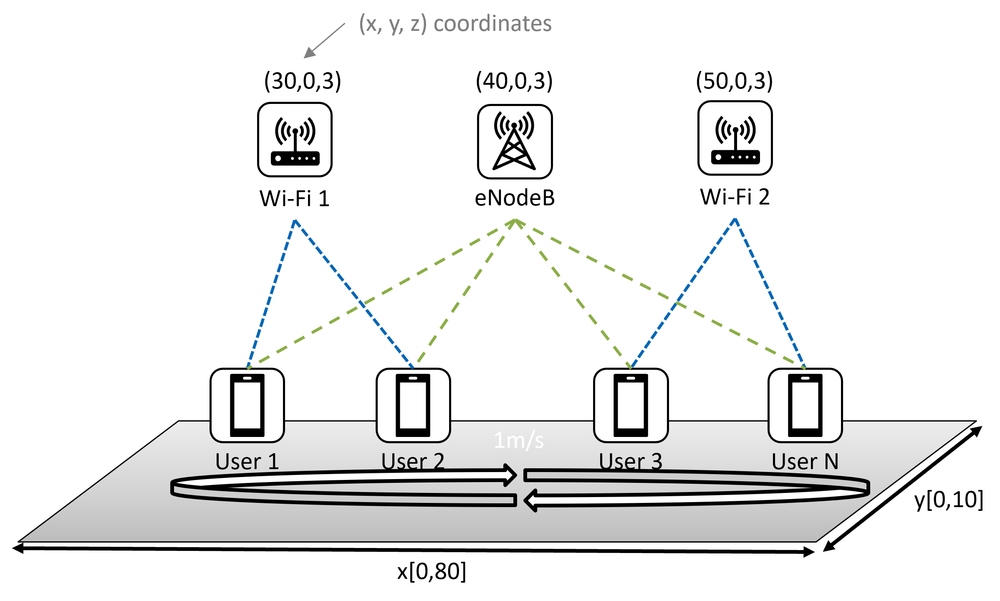

# Multi-Access(MX) Traffic Splitting



This environment is part of the multi-access traffic management environments which contains general information about the environment.
the agent performs the following action at regular intervals: it updates the traffic split ratio for each user, considering both Wi-Fi and LTE connections.

| | |
| ----- | ---- |
| Action Space    |  `Box(0.0, 1.0, (N,), float32)`  |
| Observation Space | `Box(0, Inf, (3, N,), float32)`  |
| Arguments | [config.json](https://github.com/pinyaras/GMAClient/blob/main/network_gym_client/envs/nqos_split/config.json)  |
| Select Environment | `python3 main_rl.py --env=nqos_split`  |

## Description
The Multi-Access(MX) Traffic Splitting is a traffic management problem that consists of multiple users randomly distributed on a 2D plane, and all users connect to Cellualr and Wi-Fi links.
The goal of the traffic management is to strategically split traffic over both links, such that the throughput is high and latency is low.


## Prerequisite

Make sure you have the access to the NetworkGym Server on [vLab](https://registration.intel-research.net/) machines and downloaded the [NetworkGymClient](https://github.com/pinyaras/GMAClient).

## Observation Space
The observation is a `ndarray` with shape `(3,N,)` representing the 3 features for N users. The first feature is MAX LTE rate representing the user's estimation of channel capacity, e.g., the max rate if the user utilizes all resources. The Seoncd feature is the Max Wi-Fi rate and the Third feature is received throughput combing both links.
| Feature | Observation | Min | Max |
| ----- | ---- | ----- | ---- |
| 0 | MAX LTE rate (mbps) | 0.0 | Inf |
| 1 | MAX Wi-Fi rate  (mbps) | 0.0 | Inf |
| 2 | throughput (mbps) | 0.0 | Inf|


````{Note}

```{eval-rst}
The Observation Space can be customized in the :meth:`network_gym_client.envs.nqos_split.Adapter.prepare_observation` function.
```
````

```{tip}
The Observation Space can be normalized using the [NormalizeObservation](https://gymnasium.farama.org/_modules/gymnasium/wrappers/normalize/#NormalizeObservation) wrapper.
```

## Action Space
The action space is a `ndarray` with shape `(N,)` representing the traffic ratio over Wi-Fi for N users. The traffic ratio over Cellualr equals (1.0 - action).
| Num | Action | Min | Max |
| ----- | ---- | ----- | ---- |
| 0 | Wi-Fi traffic ratio for user 0 | 0.0 | 1.0 |
| 1 | Wi-Fi traffic ratio for user 1| 0.0 | 1.0 |
| ... | | | |
| N-1 | Wi-Fi traffic ratio for user N-1| 0.0 | 1.0 |

```{tip}
The Action Space can be rescaled using the [RescaleAction](https://gymnasium.farama.org/_modules/gymnasium/wrappers/rescale_action/) wrapper.
```

## Transition Dynamics
Given an action (Wi-Fi split ratio for user i: R[i]), transmitter i follows the following transition dynamics:
- transmit R[i] traffic over Wi-Fi link.
- transmit the (1-R[i]) traffic over LTE link.

## Reward

```{eval-rst}
We compute a utility function :math:`f = log(throughput)-log(OWD)` as the reward, where OWD is the one-way delay.
The goal of the utility function is to maximize the throughput and minimizing delay.
```

````{Note}

```{eval-rst}
The Reward can be customized in the :meth:`network_gym_client.envs.nqos_split.Adapter.prepare_reward` function.
```
````

## Arguments
All the network configurable parameters are defined in the json files. When the client starts, the json files will be loaded and transmit to the server to configure the environment.
See the [⚙️Configurable File Format section](https://github.com/pinyaras/GMAClient#%EF%B8%8F-configurable-file-format) for more details.

## Starting State
The position of the users is assigned by a uniform random value in a 2D plane with configurable (x, y) boundries. The starting velocity of the users can also be configure in the json file.

## Episode End

A network environment lasts for E Episodes and each episode truncates at L time steps (E*L time steps per environment session). Both E and L can be configured in json files.

The episode ends if either of the following happens:
1. Truncation: The length of the episode is L. After a truncation, the environment will continue running to generate results for the next episode. I.e., the environement paramters cannot be configured after truncation episode end.
2. Termination: The environemnt terminates after E Episodes. The agent may reconfigure the environment to continue training the agent.

Here is an example:
```{mermaid}
sequenceDiagram

    agent->>+env: Environment Start (E=3)
    env-->>agent: Episode End (Truncation=True, Termination=False)
    env-->>agent: Episode End (Truncation=True, Termination=False)
    env-->>-agent: Episode and Environment End (Truncation=True, Termination=True)

    agent->>+env: Environment Start (E=1)
    env-->>-agent: Episode and Environment End (Truncation=True, Termination=True)

```