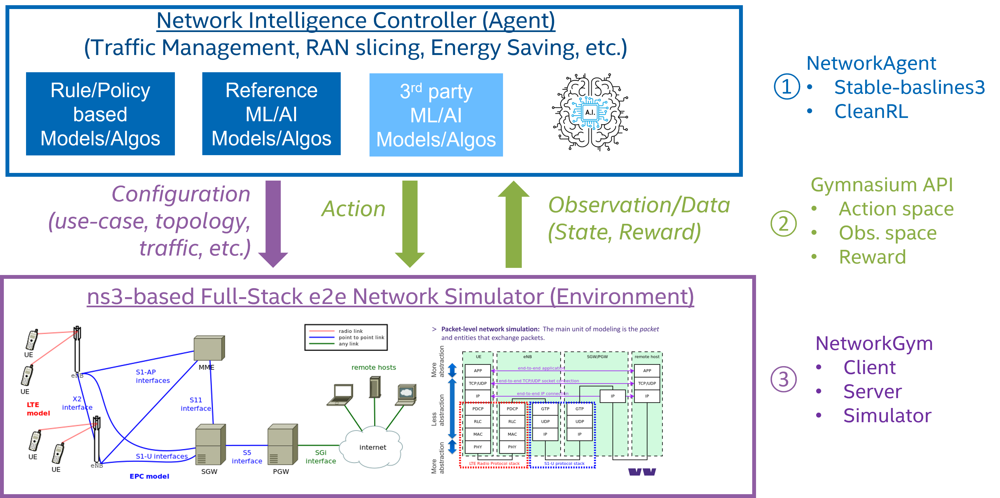

# NetworkGym: Network Simulation-as-a-Service
Introducing NetworkGym, an open Simulation-as-a-Service framework to revolutionize Network AI Research and Development.The classic “agent-environment loop” pictured below is simplified representation of reinforcement learning that NetworkGym implements.



## Network Agent
We provides four types of network agents to interact with NetworkGym Environments.
- [Stable-Baselines3 network agent.](https://github.com/pinyaras/GMAClient)
- CleanRL network agent. *(Will provide link later.)* 
- System default agent. To enable the system default action, simply send "empty" action to the environment. It can be used to collect data for offline training.
- Custom algorithm agent. A user defined agent.


## Gymnasium API
We utilize the standard [Gymnasium](https://gymnasium.farama.org/) based action and observation space API for the network agent to interact with the environment.

## NetworkGym
NetworkGym comprises three key components, each playing a vital role in the framework. 
- **NetworkGym Client:** This Python-based interface provides Gymnasium based API for the network agent to interact with the NetworkGym Environment Remotely. It also provides its own NetworkGym API to configure the NetworkGym Environment parameters.
- **NetworkGym Server:** The server manages the connects between Clients and Environments.
- **NetworkGym Environment:** Leverage open-source network simulation tools, e.g., [ns-3](https://www.nsnam.org/); Enhance it with customized capabilities & use-cases, e.g. Traffic Steering, Network Slicing, Distributed Compute, Dynamic QoS, Energy Saving, etc.

### Why Dividing NetworkGym to Three Components?
There are multiple reasons that we seprate the Client and Environment. For example,
- Client and Environment may use different programming langugages. E.g., A Python based Agent can interact with a C++(ns-3) based simulation environment.
- Client and Environment may be deployed on different machine or platform. E.g., A Agent deployed on a machine optimized for ML workload can interact with Environment deployed on a machine optimized for simulation workload.

### What is NetworkGym about and NOT about?

#### ✔️ In-Scope 
- Develop **open & reference** AI models/algos for **networking research (Layer 2 & above)**
- Develop **abstract models**, e.g. channel, compute, power, etc. for the physical world & system
- Develop **full-stack models** to simulate **E2E (Access/Edge/Cloud)** network operation with high fidelity

#### ❌ Out-of-Scope
- Develop **proprietary** AI algorithms or models
- Develop AI **application or software**, e.g. xApp/rApp, etc., based on controller architecture, e.g. O-RAN RIC, etc.
- Develop **“Digital Twin”** to simulate the physical world with high fidelity


```{toctree}
:hidden:
:caption: Introduction

content/where_is_data
content/overview
content/quickstart
```

```{toctree}
:hidden:
:caption: API

api/network_gym_client
api/network_gym_server
api/network_gym_env
```

```{toctree}
:hidden:
:caption: Environments

environments/mx
```

```{toctree}
:hidden:
:caption: Development

Github <https://github.com/pinyaras/GMAClient>
Contribute to the Docs <https://github.com/pinyaras/GMAClient/tree/main/docs>
```