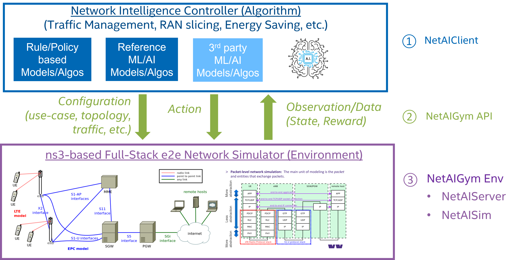

# NetworkGym: Network Simulation-as-a-Service
Introducing NetworkGym, an open Simulation-as-a-Service framework to revolutionize Network AI Research and Development. NetworkGYm comprises three key components, each playing a vital role in the framework:



- **[NetworkGymClient](https://github.com/pinyaras/GMAClient):** This **Python**-based interface that offers researchers and developers a comprehensive development environment following the Open AI Gym/[Gymnasium](https://gymnasium.farama.org/) standards.
It caters to the development of both AI and non-AI algorithms, empowering users with a versatile toolkit such as [Stable-Baselines3](https://stable-baselines3.readthedocs.io/en/master/) and [WanDB](https://wandb.ai/site).
- **NetworkGym API:** Open API for collecting data and interacting with the simulated network environment.
- **NetworkGym Env (NetworkGym Server & Simulator):** Leverage open-source network simulation tools, e.g., [ns-3](https://www.nsnam.org/); Enhance it with customized capabilities & use-cases, e.g. Traffic Steering, Network Slicing, Distributed Compute, Dynamic QoS, Energy Saving, etc.

## What is NetAIGym about and NOT about?

### ✔️ In-Scope 
- Develop **open & reference** AI models/algos for **networking research (Layer 2 & above)**
- Develop **abstract models**, e.g. channel, compute, power, etc. for the physical world & system
- Develop **full-stack models** to simulate **E2E (Access/Edge/Cloud)** network operation with high fidelity

### ❌ Out-of-Scope
- Develop **proprietary** AI algorithms or models
- Develop AI **application or software**, e.g. xApp/rApp, etc., based on controller architecture, e.g. O-RAN RIC, etc.
- Develop **“Digital Twin”** to simulate the physical world with high fidelity


```{toctree}
:hidden:
:caption: Introduction

content/where_is_data
content/overview
content/quick_start
```


```{toctree}
:hidden:
:caption: Components

content/client
content/server
content/env
```

```{toctree}
:hidden:
:caption: Client API

client_api/env
client_api/adapter
client_api/northbound_interface
```

```{toctree}
:hidden:
:caption: Environments

environments/mx
```

```{toctree}
:hidden:
:caption: Development

Github <https://github.com/pinyaras/GMAClient>
Contribute to the Docs <https://github.com/pinyaras/GMAClient/tree/main/docs>
```